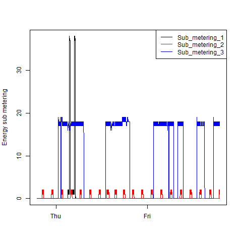
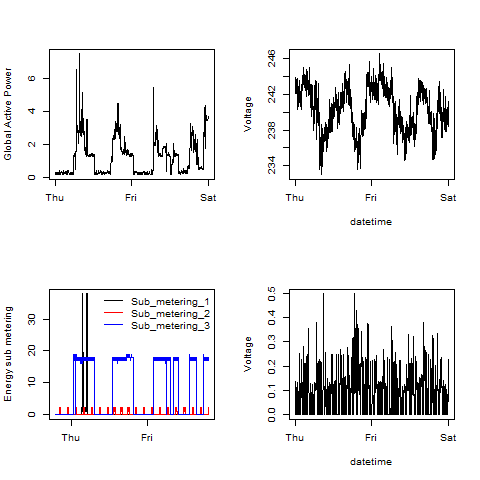

# Coursera Exploratory Data Analysis Project 1

Please find the 4 plotX.R files and 4 plotX.png files in the repository. For code reuse, each plotX.R file uses the DownloadAndReadHouseholdPowerConsumptionData.R file.

### Plot 1
 

### Plot 2
 

### Plot 3
 

### Plot 4
 